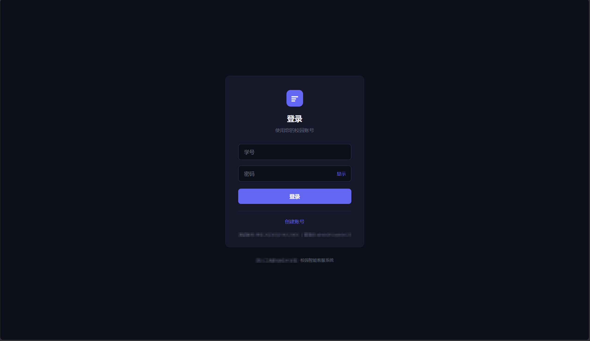
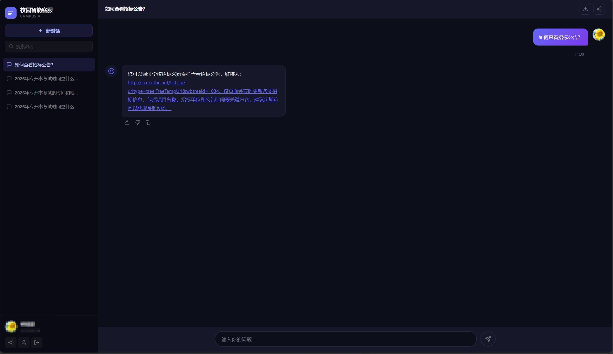
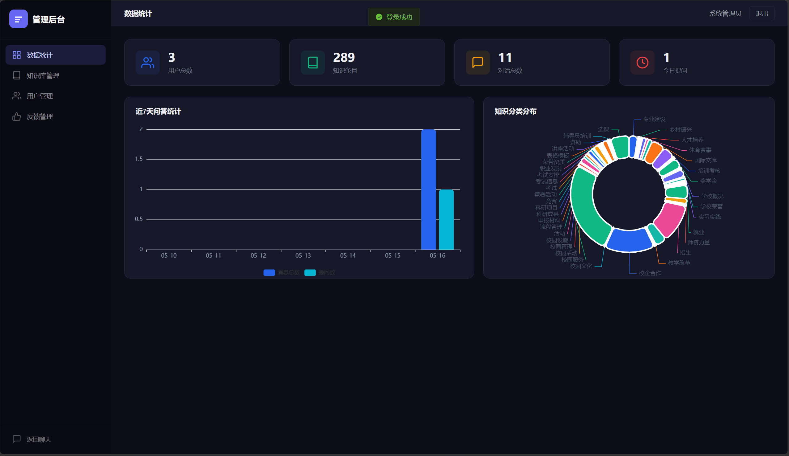

# Campus AI - 校园智能客服系统

基于大语言模型（LLM）与 RAG 检索增强生成的校园智能客服系统，专为四川工商职业技术学院设计，支持自然语言问答、知识库管理、对话历史等功能。

## ✨ 核心功能

- **AI 智能问答** — 基于 Ollama + qwen3:8b 本地部署，流式逐字输出，无需网络
- **RAG 知识库检索** — 结合校园知识库（招生、考试、图书馆等），提升回答准确度
- **多轮对话上下文** — 记住对话历史，支持连续追问
- **知识库管理** — 后台增删改查，AI 爬虫自动从学校官网提取 Q&A
- **用户反馈** — 点赞/点踩，管理员后台可查看反馈统计
- **数据大屏** — 管理员仪表盘，ECharts 图表展示使用趋势
- **用户管理** — 角色权限控制（学生 / 管理员）
- **深色模式** — CSS 变量切换，全局适配
- **对话导出** — 支持导出 TXT 格式

## 🏗 系统架构

```
┌─────────────────────────────────────────────────┐
│                   前端 (Vue 3)                    │
│  Element Plus + Pinia + Vue Router + ECharts      │
└──────────────────┬──────────────────────────────┘
                   │ HTTP / SSE
┌──────────────────▼──────────────────────────────┐
│              后端 (Spring Boot 3.2)                │
│  Spring MVC + JPA + Security + JWT                │
│  ┌──────────┐  ┌──────────┐  ┌───────────────┐  │
│  │ 知识库检索 │  │ 对话管理  │  │  用户认证鉴权  │  │
│  └──────────┘  └──────────┘  └───────────────┘  │
└──────┬──────────────┬───────────────────────────┘
       │ RAG 检索     │ Ollama API
┌──────▼──────┐  ┌────▼────────────┐
│    MySQL    │  │  Ollama (本地)   │
│ campus_ai   │  │  qwen3:8b 模型  │
└─────────────┘  └─────────────────┘
```

## 🛠 技术栈

| 层级 | 技术 |
|------|------|
| 前端 | Vue 3, TypeScript, Vite, Element Plus, Pinia, Vue Router, Axios, ECharts |
| 后端 | Spring Boot 3.2, Java 17, Spring MVC, Spring Data JPA, Spring Security |
| AI 模型 | Ollama, qwen3:8b, RAG 检索增强生成, SSE 流式输出 |
| 数据库 | MySQL 8.0 |
| 安全 | JWT + BCrypt + RBAC 角色权限 |

## 📁 项目结构

```
campus-ai/
├── server/                    # 后端项目
│   ├── src/main/java/com/campusai/
│   │   ├── config/            # 安全、CORS、异常处理配置
│   │   ├── controller/        # REST API 控制器
│   │   ├── dto/               # 数据传输对象
│   │   ├── model/             # JPA 实体
│   │   ├── repository/        # 数据访问层
│   │   ├── security/          # JWT 过滤器
│   │   ├── service/           # 业务逻辑层
│   │   └── util/              # 工具类
│   └── pom.xml
├── web/                       # 前端项目
│   ├── src/
│   │   ├── api/               # API 请求封装
│   │   ├── composables/       # 组合式函数
│   │   ├── router/            # 路由配置
│   │   ├── store/             # Pinia 状态管理
│   │   └── views/             # 页面组件
│   └── package.json
└── tools/                     # 辅助工具
    └── knowledge_crawler/     # 知识库爬虫（AI 自动提取）
```

## 🚀 快速开始

### 环境要求

- JDK 17+
- Node.js 18+
- MySQL 8.0
- Ollama（已安装 qwen3:8b 模型）

### 1. 创建数据库

```sql
CREATE DATABASE IF NOT EXISTS campus_ai;
```

### 2. 配置后端

修改 `server/src/main/resources/application.yml`：

```yaml
spring:
  datasource:
    url: jdbc:mysql://localhost:3306/campus_ai
    username: root
    password: 你的数据库密码

app:
  jwt:
    secret: 你的JWT密钥

ollama:
  base-url: http://localhost:11434
  model: qwen3:8b
```

### 3. 启动后端

```bash
cd server
mvn spring-boot:run
```

后端运行在 `http://localhost:8080`

### 4. 启动前端

```bash
cd web
npm install
npm run dev
```

前端运行在 `http://localhost:3000`

### 5. 一键启动（Windows）

双击项目根目录的 `start.bat`

### 默认账号

| 角色 | 账号 | 说明 |
|------|------|------|
| 学生 | 注册后使用 | 注册时需要学号 |
| 管理员 | admin | 后台管理入口：`/admin/dashboard` |

## 🔧 知识库爬虫

`tools/knowledge_crawler/` 目录包含 AI 驱动的知识库构建工具：

```bash
# 安装依赖
pip install -r requirements.txt

# 交互式运行
python main.py

# 爬取指定网页并用 AI 提取 Q&A
python main.py --url "https://学校官网页面地址"
```

爬虫流程：
1. 爬取网页 / Word 文档内容
2. 分块后调用 Ollama 提取结构化 Q&A
3. 导出 Excel，可直接导入知识库
4. 支持断点续传

## 📸 页面截图

| 登录 | 问答 | 后台 |
|------|------|------|
|  |  |  |